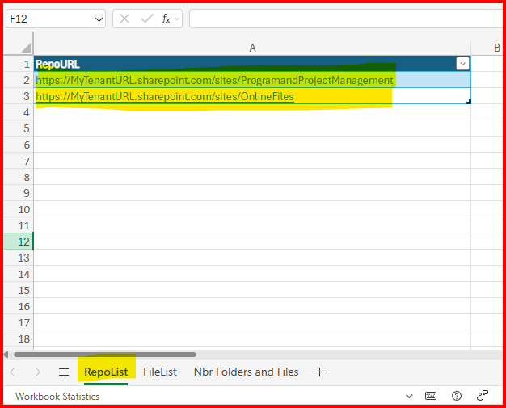
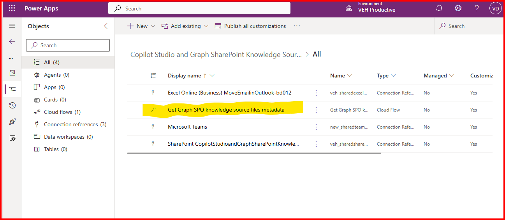
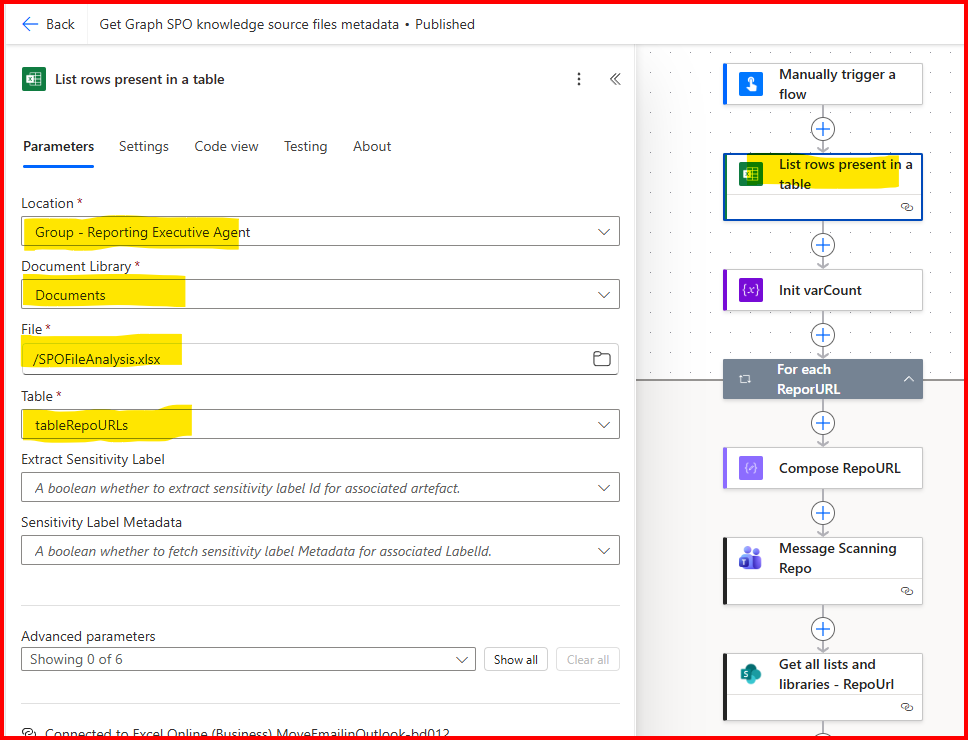
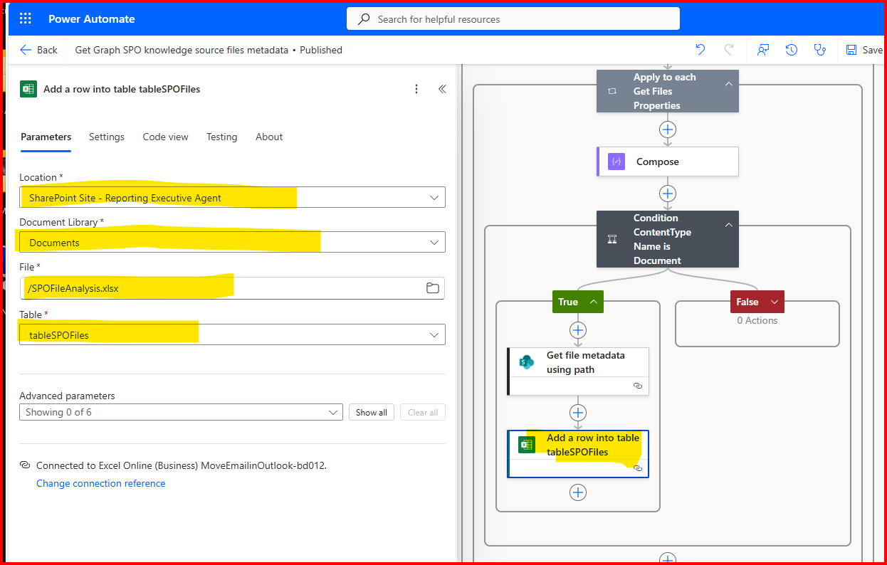

# The SharePoint Online File Analysis Tool For Copilot Studio Knowledge Sources #

This tool is concerned with the limitations of using SharePoint as a Knowledge source as identified here: [https://learn.microsoft.com/en-us/microsoft-copilot-studio/requirements-quotas#copilot-studio-web-app-sharepoint-limits](https://learn.microsoft.com/en-us/microsoft-copilot-studio/requirements-quotas#copilot-studio-web-app-sharepoint-limits). More specifically it's concerned with the number of files, the types of files and the size of files in the SPO repository.

Note: SPO = SharePoint Online

The tool scans an SPO site and all associated document repositories. It retrieves paths, file names, file type and file size. It stores the results in Excel spreadsheet that is part of this tool.

## Requirements ##
SPO repo where to store your data file.

Minimum Power Automate license via M365 license entitlement.

Enabled Microsoft Teams license.

At least read access to available SPO repos to scan.

## Installation Instructions ##

### Download Files ###
Download the following files from the latest [Release]() folder.

- SPOFileAnalysis.xlsx
- CopilotStudioandGraphSharePointKnowledgeSource_n_n_n_n.zip

### Configure The SPO Repos to be Scanned ###
Copy SPOFileAnalysis.xlsx to a location in SPO.

Open SPOFileAnalysis.xlsx to the tab RepoList. 

Add each SPO URL as a record in the table.

### Install and Configure the Solution ###
Nagivate to [make.powerapps.com](make.powerapps.com)

Click on Solutions from the left-hand menu.

Click "Import solution" from the top menu.

Select the CopilotStudioandGraphSharePointKnowledgeSource_n_n_n_n.zip file and import it.

Wait until the message appears that the solution was imported successfully.

You may get a warning about the Flow being replaced. You may disregard it.

To configure the solution, from the list of solutions, click on "Copilot Studio and Graph SharePoint Knowledge Source"

From the list of components, click on the Power Automate Flow "Get Graph SPO knowledge source files metadata"

From the second step (action) in the flow, update the values as shown in the below photo to select the table in the RepoList tab.

Scroll down and open up all the steps until you open the "Add a row into table tableSPOFiles" step. Update the values as shown to select the table in the FileList tab.

Publish the Flow.

## Use the Tool ##
Run the Flow to retrieve the list of files in the selected Repos. 
- The Flow will loop through all the files in the Repos listed.
- For each file, it will create an entry in the FileList tab.
- Rough estimates show that the Flow processes 1 file every second. (i.e. 60 files will take 1 minute)
- Once the Flow finishes running, open the file to view your results.

Sort and filter on "File Type" and "Size (KB)" to identify problem areas like files over 200 MB or 500 MB. 

Use the pivot table in the tab "Nbr Folders and Files" to determine problem areas like exceeding the total number of folders or files for which Copilot Studio can accomodate.
- Note: you'll have to refresh the Pivot Table the first time you open the file after you run the Flow.
